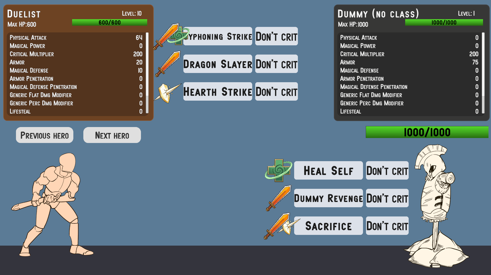
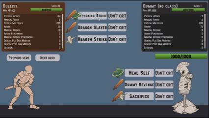
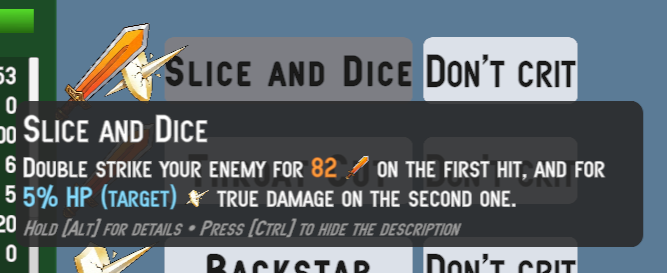
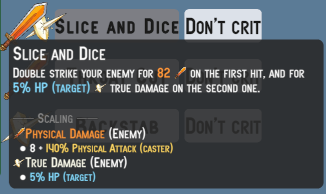
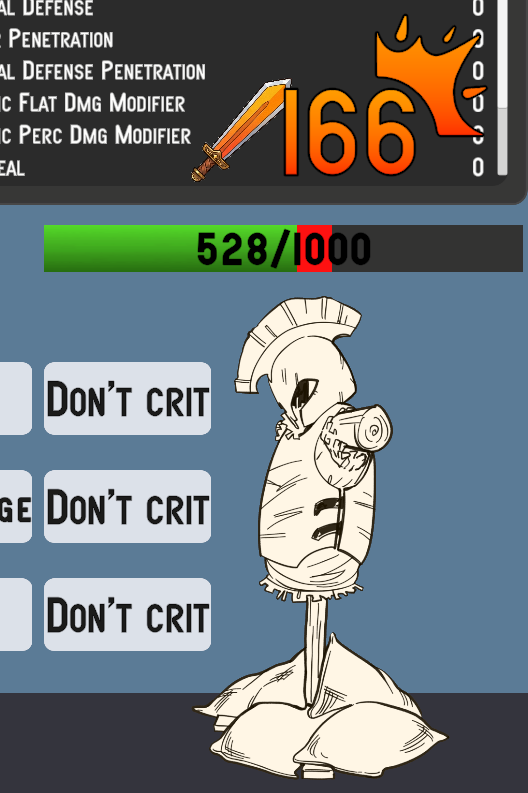

# Samples

## No More Utils Folder
Unlike Astra RPG Framework, in this package you will not find a `Utils` folder among the various samples. I made this decision because I believe it is wiser and more robust to let you create your own instances. This is because if you build your project around the instances I provide in the samples, and then decide to import a new version of the package and reimport the samples, you risk getting confused about which instances from which version you are currently using for your project. By letting you create all the framework object instances yourself, this problem is completely avoided.
Furthermore, the instances present in the sample scene's samples are marked with a `(Astra Health Samples)` suffix, making them easily identifiable and distinguishable from any instances you might create for your own project.

If you want to draw inspiration from the instances in the samples, feel free to do so, but I recommend creating new instances for your project to avoid any future confusion.

## Examples Folder - Overview
Inside the `Examples` folder you will find a sample scene: it is your sandbox for trying out the features of Astra RPG Health. Compared to the minimal one in Astra RPG Framework, this scene has more content and features to explore.
The scene covers all the main features of Astra RPG Health:
- Health System
- Damage Types
- Damage Sources
- Damage Reduction
- Defense Penetration
- Healing System
- Heal and Damage Modifiers
- Passive Regeneration
- Resurrection System
- Event System
- Health Scaling Component
- Experience Collection System

### The Scene - Overview

_Sample scene as you enter in play mode_

If you open and start the sample scene, you will see a stylized fighter on the left (Duelist) and a dummy on the right (Dummy). Without much surprise, you can unleash the wrath of your character against the poor dummy in order to test the features of Astra RPG Health.
Before taking it out on the dummy, let's take a look at the rest of the scene. Above the duelist there is a panel containing the character's name, level, optional class, health bar, and finally the character's stat values. A similar panel is present above the dummy. You can scroll with the mouse wheel on these panels to view all the statistics. You will notice that unlike the Astra RPG Framework sample scene, the panels in this scene do not show attributes. This is because I intentionally excluded their use in this scene, in order to focus on the features of Astra RPG Health. Had I included attributes as well, it would have been more complex to reason about the effect of damage calculation formulas, reductions, penetrations and so on, since the stat values would also have been influenced by the attributes. Therefore, for simplicity, in this sample scene you will only need to focus on statistics.

In addition to the stats panels, you will notice that there are also buttons with one or two icons to their left. These represent the abilities that each character can use. And yes, even the dummy has a say in this and can take revenge for the mistreatment it has suffered in various video games over the decades.
Each character has 3 abilities; each row of icon(s) + 2 buttons constitutes a single ability. For each ability, the first button contains its name and is the activation point. The button to its right is a toggle that defines whether the ability will perform a critical hit or not. Finally, the icon, or icons, to the left of the ability name represent the damage types that the various effects of the ability can inflict, or a heal if the ability's effect is a healing one. A single icon means the ability has a single effect, while two icons indicate the ability has two or more effects. If there are 3 or more effects, only the icons of the first 2 effects will be shown.
The icons you will find are 4 in total:
- An orange sword, representing physical damage
- A purple flame, representing magical damage
- A white perforated shield, representing pure damage
- A green cross, representing healing

The sword, the flame and the perforated shield therefore represent damage effects, and are associated with the respective damage types. The green cross instead represents a healing effect.

> [!WARNING]
> I want to specify that the implementation given for abilities in this sample scene is simplistic and does not represent a complete ability system. It was necessary to introduce a minimal ability system to demonstrate the features of Astra RPG Health, but do not consider this implementation as a reference point for creating a more complex ability system.
> It will be the responsibility of a future Astra extension package to provide a complete and flexible ability system. For now, consider this implementation as a simple tool for testing the features of Astra RPG Health.

You will also notice that just above the duelist's head there are a couple of buttons, reading "\[D\] Next Hero" and "\[A\] Previous Hero". These buttons allow you to change your character. Alternatively to the buttons you can use the D and A keys on the keyboard. In addition to the duelist, who focuses on abilities that deal physical damage and healing, there are 2 other characters, each with a different focus. The second character, the Assassin, focuses on abilities that deal physical and pure damage, sometimes with scaling based on the enemy's health. The third character, the Mage, focuses on abilities that deal magical damage.

### The Hierarchy - Overview
If you now take a look at the scene hierarchy you will see that, in addition to the default main objects, it contains:
- the dummy entity
- the dummy's canvas (stats panel and abilities panel)
- a section with the entities of the three playable characters (duelist, assassin and mage). The duelist is active at scene start, while the other two characters are disabled. Changing characters with the "\[D\] Next Hero" and "\[A\] Previous Hero" buttons, you will cycle through these three characters, activating one at a time and deactivating the other two.
- a section with the canvases of the three playable characters (stats panel and abilities panel for each character). Also in this case, the duelist's canvas is active at scene start, while the other two canvases are disabled.
- A `HeroSelector` object. This object has as children the game objects representing the "\[D\] Next Hero" and "\[A\] Previous Hero" buttons.
- A `PopupCanvas` object, which contains two sub-objects: `DamagePopupManager` and `HealPopupManager`. These objects are responsible for creating the damage and healing popups that appear above the characters' heads when they take damage or receive healing.

**Each entity has the Astra components `EntityCore`, `EntityClass`, `EntityStats`, and the new `EntityHealth` on the root object.** The dummy does not have a class. This choice is not to discriminate against our wooden friend, but simply because it simplifies changing the dummy's statistics to facilitate testing the package's features. This way, if you wanted to change the Armor to see how the damage reduction changes in real-time, you don't need to go through the Growth Formula associated with that stat in the dummy's class, but you can simply modify its value through `EntityStats`. Simple and effective.

Each entity (including the dummy) also has two sub-objects: `Visuals` and `Skills`. The first contains all the objects responsible for the character's visual representation (sprite and health bar for the dummy, sprite and attack sprite for the player characters), while the second is used to specify the character's abilities.

The objects related to the entity canvases instead have the following sub-objects: a `HeroPanel` responsible for showing the panel with the character's name, level, class, health bar and statistics, and a `SkillsPanel`, which contains the buttons and icons related to the character's abilities.

### The Project Files - Overview

In the resource explorer, in the package samples, in addition to the sample scene, you will have these folders:
- **Art**: Contains all the artistic resources used in the sample scene.
- **Instances**: This is the most important folder, as it contains all the instances of the objects provided by Astra RPG Health. You will find yourself interacting a lot with these instances to test the package's features, and you can draw inspiration from them to create your own custom instances for your project.
- **Prefabs**: Contains the prefabs of all the objects present in the sample scene.
- **Resources**: Contains the Astra RPG Health configuration instance for the sample scene.
- **Scripts**: Contains all the scripts used in the sample scene.

> [!WARNING]
> A note regarding `Resources`. As explained in [Global Settings](./workflows/package-configuration.md#global-settings), Astra RPG Health uses an `AstraRpgHealthConfigSO` instance to configure its features in your Unity project. This specific instance provided in the samples has been configured for the sample scene. The scene works right out of the box because the configuration resource, being named exactly `Astra Rpg Health Config`, is automatically loaded by Astra RPG Health upon package import and assigned in the package's global configuration.
>
> When you go to create your own `AstraRpgHealthConfigSO` configuration instance for your project, you will need to assign it manually to the global configuration of Astra RPG Health, as explained in [Project Settings](./workflows/package-configuration.md#project-settings) through the project settings, or alternatively, as explained in [Manual Configuration](./workflows/package-configuration.md#manual-configuration-alternative-to-project-settings), by assigning it directly to the `AstraRpgHealthGlobalSettings` instance found in the `Assets/Resources` folder (this resources folder is located at the root of Assets, not in the package samples).
>
> If you do not assign your configuration instance to the global configuration of Astra RPG Health, the package will continue to use the samples configuration, creating confusion and potential configuration issues.

### Instances Folder
Now we will focus on the `Instances` folder, which is the most relevant one for you.

#### Spare object: Default Damage Calculation Strategy
Let's start with the loose `Default Damage Calculation Strategy` object. It represents the [damage calculation strategy](./workflows/damage.md#damage-calculation-strategy) used by default in the scene.

#### Statistics and Stat Sets
In the `Stats` folder you will find all the instances of the `Stat` and `StatSet` used in the sample scene. You can explore the statistics and stat sets in detail yourself; the only thing I want to highlight is that the `Hero Stat Set` is the stat set used by all 4 characters in the sample scene (duelist, assassin, mage and dummy).

#### Classes
In the `Classes` subfolder you will find all the classes for the 3 playable characters and all the related growth formulas that define the progression of their statistics. There is also a `Common` folder that contains some utilities shared by multiple classes. For example, the `200% Const Critical Multiplier GF` is a growth formula that returns a 200% multiplier for critical hits at all levels. Usually a game uses a fixed multiplier for all entities at all levels, so it makes no sense to duplicate this growth formula in every class, but it is more efficient to create a single instance and share it among all the classes that need it.

#### Damage Sources
In the `Sources - Damage` subfolder you will find two damage sources: `Skill` and `Environmental`. The scene does not make use of environmental damage, but the damage source is used in [Experience Collection](./workflows/experience-collection.md), particularly in the `Environmental Kill Exp Strategy` strategy. Therefore, although it cannot be tested in the scene, it has value as an example to show you how to create and configure a multiple strategy that uses both the direct kill and the environmental kill strategies.

#### Damage Types
In the `Damage Types` subfolder you will find the three damage types used in the sample scene: Physical, Magical and True, and two folders containing the three variants of Damage Reduction Functions and Defense Reduction Functions. Currently, both physical and magical damage use the logarithmic formula for damage reduction based on the defensive stat, and percentage reduction for defensive stat penetration. I have provided all three to make it easier for you to test should you want to swap the formulas on the fly.

#### Events
In `Events` you will find all the instances of the game events used by the sample scene. All the instances belong to Astra RPG Health except for `Entity Leveled Up Game Event` and `Entity Leveled Down Game Event`.
These events have been connected as [global events](./workflows/package-configuration.md#global-events) in the `AstraRpgHealthConfigSO` configuration.

All communications between the various objects in the sample scene are handled through these events.

#### Experience Collection
In the `Experience Collection` folder there are all the instances and strategies used for experience collection in the sample scene. As mentioned earlier, the sample scene does not involve the use of environmental damage, but I have nonetheless included an `Environmental Kill Exp Strategy` strategy to show you how to create and configure a multiple strategy that uses both the direct kill and the environmental kill strategies.

#### Heal Sources
Unlike the damage sources, in the sample scene all 4 `HealSourceSO` instances found in the `Sources - Heal` folder are used:
- `HP Regeneration`: used by passive health regeneration events
- `Lifesteal`: used by lifesteal effects
- `Resurrection`: used by the heal applied upon an entity's resurrection
- `Skill`: used by abilities that have healing effects

#### Game Actions
In `Game Actions` you will find `On Death Game Actions` and `On Resurrection Game Actions`. These are used to define the behavior of entities in response to their death and resurrection respectively. We will cover this topic in more detail later on this page.

#### Skills
Finally, in the `Skills` folder you will find all the instances of the abilities used in the sample scene, divided by character. Each ability has its own `SkillSO` instance, and a `ScalingFormula` with one or more associated `ScalingComponent`s. Some abilities, as mentioned before, can have more than one effect. In that case, they have a scaling formula for each effect.

#### Passives
In the `Passives` folder you will find the object instances needed for the passive abilities implemented for the sample scene to work. We will look at passive abilities later in [Implementing Custom Passive Abilities](#implementig-custom-passive-abilities).

## Interacting with the Scene
Now that we have explored the sample scene, the hierarchy and the project files, let me give you some information about some specific configurations that deserve a bit more explanation.

### Casting Skills to Deal Damage and Heal
The skills of the sample scene can be summarized, from a technical standpoint, as builders of `PreDamageContext` and `PreHealContext` that route these contexts toward the target entities. The target will process these contexts in its `heal` and `TakeDamage` methods. The damage calculation that takes place inside `TakeDamage`, as we have seen in the workflows, passes through the damage calculation pipeline. The pipeline uses the strategy that has been configured at the `AstraRPGHealthConfigSO` configuration level.
When the entity is healed or takes damage, it will invoke the respective Global Events also configured in the package configuration. And the heal and damage pop-up managers found in the hierarchy are listening to these two events respectively. When they receive the event, they create a pop-up above the target character's head showing the amount of damage taken or healing received. The damage pop-ups will have different colors and icons based on the type of damage dealt. The icons (and color) will match those you see to the left of the ability you cast.

  
_Casting Skills and Damage and Heal Pop-Ups_

If you hover over an ability button, you will see a tooltip appear showing a description of the ability. If you hold the `Alt` key while the tooltip is visible, you will see the scaling details of the various ability effects appear. These descriptions should help you predict the order of magnitude of the damage and heals that the various ability effects can deal, and understand how the characters' level up influences the power of their abilities.

  
_Collapsed tooltip_

  
_Expanded tooltip with details_

You can also toggle whether to show or not the description by clicking `Ctrl`.

If you press the "Don't crit" button, the text will change to "Do crit", and the ability you cast from that point on will deal a critical hit. The pop-up of a critical hit has a custom icon in the top right, and looks like this:  

### Messing Around with Damage Types and Damage Calculation Strategy
Here you can go wild and play with various settings to radically change the way damage is calculated. Let's start by observing the configuration of the damage types:

| Damage Type | Defensive Stat | Damage Reduction Function | Defense Penetration Stat | Defense Penetration Function | Flat Damage Modifier Stat | Percentage Damage Modifier Stat | Ignores Barrier | Ignores Generic Perc. Dmg Modifiers | Ignores Generic Flat Dmg Modifiers |
| --- | --- | --- | --- | --- | --- | --- | --- | --- | --- |
| Physical | Armor | Logarithmic DR | Armor Penetration | Percentage DP | Physical Flat Dmg Mod | Physical Percentage Dmg Mod | ✗ | ✗ | ✗ |
| Magical | Magic Resist | Logarithmic DR | Magic Penetration | Percentage DP | Magical Flat Dmg Mod | Magical Percentage Dmg Mod | ✗ | ✗ | ✗ |
| True | None | None | None | None | None | None | ✓ | ✓ | ✓ |

You can notice that physical and magical damage both use the same logarithmic formula for damage reduction and the same one for defense penetration, but clearly use different statistics for reduction and penetration. True damage instead has no associated defensive stat, so it does not suffer any reduction. Having no associated defensive stats, it also has no defense penetration.
In addition to the defensive stats and the related reduction and penetration formulas, physical and magical damage also define statistics for flat and percentage modifiers for the specific damage type. I refer you to the documentation on [Damage Type's Damage Modifiers](./workflows/damage.md#damage-types-damage-modifiers) for more details on how these stats work and how they are used in the damage calculation pipeline. You can test the impact of these stats by modifying their values in the Dummy's `EntityStats`. **Also remember that the order of application of flat and percentage modifiers is defined in the configured damage calculation strategy. In the sample scene you will find it under `Examples/Instances/Default Damage Calculation Strategy`.** Its initial configuration is:
1. Apply Critical Multiplier
2. Apply Defenses
3. Apply Barrier
4. Apply Percentage Damage Modifiers
5. Apply Flat Damage Modifiers

You can of course reorder these steps as you prefer to see how the final damage result changes based on the order of application of the steps.

To conclude the observations on damage types, you can notice that true damage ignores both flat and percentage modifiers, in addition to the barrier. This means that the damage, besides not being reduced, cannot be amplified either. **The only mechanic that modifies the value of true damage is the critical multiplier.**

There is one last thing worth mentioning on this topic, and it is the configuration of the stats for flat and percentage damage modifiers (this applies to both damage-type specific and generic ones). The stats for percentage damage modifiers are configured differently from flat ones. If you open the `Physical Dmg Perc Mod` stat in the inspector, you will notice that it has a minimum value of -100, while the `Physical Dmg Flat Mod` stat does **not** have a minimum value. This is because a damage modifier percentage can never exceed -100% (complete damage negation), while a flat modifier can theoretically reduce damage by any value.
It is the responsibility of the flat damage modifiers step in the damage calculation pipeline to ensure that the final damage does not drop below zero due to a flat damage modifier that exceeds the damage value.
An observation you might raise is "What if an entity has the generic damage percentage modifier at `-70`% and the damage-type specific percentage modifier at `-50`%? In that case, the damage will suffer a total reduction of 120%, right?". Correct! However, as explained in [ApplyPercentageDmgModifiersStep](./workflows/damage.md#applypercentagedmgmodifiersstep), the construct used internally by the damage calculation pipeline lower-bounds the damage amount transformations at 0. Therefore, in this case, the final damage will be 0, and the damage will be prevented with `DamagePreventionReason.PipelineReducedToZero`.
Therefore, even if you did not set a lower bound of -100% on the percentage damage modifier stats, the system would still ensure that the damage does not drop below zero due to percentage modifiers; however, it is more semantically correct and clearer to set a -100% limit on these stats. This would also be useful when creating game interfaces for displaying these stats, as a player might be confused seeing a damage modifier of -150%, not knowing that in reality the damage cannot drop below zero.

### Playing with Passive HP Regeneration
In the sample scene, passive health regeneration is enabled for all characters through the dedicated `EntityPassiveHpRegeneration` component. You can disable it for a specific entity by removing that component or disabling it in the inspector. By default, healing popups will also be shown for each passive regeneration tick. If these popups bother you, you can disable them as follows:
1. From the hierarchy, open the `PopupCanvas` game object
2. Select the `HealPopupManager` game object
3. In the inspector, in the `Heal Popup Manager` component, expand the `Heal Sources To Ignore` section and press the `+` button. Drag the `HP Regeneration HS` Heal Source found in `Examples/Instances/Sources - Heal` here.

This way, the `Heal Popup Manager` will ignore all healing events that have `HP Regeneration` as their heal source, and therefore will not create pop-ups for passive regeneration ticks.

Even from this simple example, the value of creating and using different heal sources becomes clear. Heals coming from different mechanics can raise different use cases.

I have configured the regeneration tick rate to 1 second. If you wanted to change the tick rate of passive regeneration, you can do so by modifying the `Passive Health Regeneration Interval` value in the `Astra Rpg Health Config` configuration instance found in `Examples/Resources`. I also refer you to the documentation on [Package Configuration | Health Regeneration](./workflows/package-configuration.md#health-regeneration) and on [Healing | Passive Health Regeneration](./workflows/healing.md#passive-health-regeneration) for details.

To modify the passively regenerated health, you need to change the value of the `Passive Regeneration` stat. For the three playable characters, this stat is controlled through the Growth Formulas associated with their respective classes, while for the Dummy you can modify it directly through `EntityStats`.

> [!WARNING]
> Remember that, as mentioned in [Passive Health Regeneration Stat (HP/10s)](./workflows/package-configuration.md#passive-health-regeneration-stat-hp10s) in Package Configuration, the value of this stat represents the amount of health regenerated every 10 seconds. Therefore, if you want a character to passively regenerate 5 HP per second, you will need to set the value of `Passive Regeneration` to 50, not 5.

### Health Scaling Component
Some abilities use a `HealthScalingComponent` to scale their damage based on the health of themselves or the target.

- The duelist has the `Syphoning Strike` ability, which heals him based on maximum health.
- The Assassin has the `Slice And Dice` ability, where the second effect deals pure damage based on the target's current health. Additionally, `Throat Cut` deals physical damage based on the target's maximum health.
- The Sorcerer has the `Soul Explosion` ability that deals magical damage based on the target's missing health.
- All of the Dummy's abilities scale based on health.

You can explore the details of the abilities through the popup that appears on hover over the respective buttons, and you can inspect the scaling formulas and scaling components associated with each ability to see how the health-based scaling has been configured.

### Experience Collection and Death & Resurrection
In the sample scene you have the opportunity to see both the base package's `ExpSource` and the brand new `ExpCollector` of Astra RPG Health in action. I refer you to the documentation on [Experience Collection](./workflows/experience-collection.md) for details on `ExpCollector`.

All three playable characters, who have classes and therefore a level progression, have an associated `ExpCollector`. The Dummy instead has an associated `ExpSource`, and acts as a source of experience for the playable characters. As explained in the Experience Collection documentation, `ExpCollector` relies on an `ExpCollectionStrategySO` to define the experience collection rules. In the sample scene, the playable characters use a multiple strategy that involves both collecting experience through the `Direct Kill Exp Strategy` and through the `Environmental Kill Exp Strategy`, all thanks to the `FirstMatchExpStrategySO` which considers the first strategy that matches the experience collection conditions. I refer you to the configuration documentation [Package Configuration | Default Exp Collection Strategy](./workflows/package-configuration.md#default-damage-calculation-strategy) for configuring the package's default experience collection strategy.
However, I remind you that the sample scene does not involve the use of environmental damage, so the `Environmental Kill Exp Strategy` will never be activated. I have nonetheless included this strategy in the sample scene to show you how to create and configure a multiple strategy that uses both the direct kill and the environmental kill strategies.

By default the `DirectKillExpStrategySO` marks the Dummy's `ExpSource` as harvested once a playable character kills the Dummy, and therefore does not allow experience to be collected from that `ExpSource` more than once. However, at the package configuration level a multiple [Default On Resurrection Game Action](./workflows/package-configuration.md#default-on-resurrection-game-action) has been set which, among other things, resets the `ExpSource` of the resurrected entity. Therefore, since the `Default On Death Game Action` resurrects entities after 3 seconds, and the `Default On Resurrection Game Action` resets the `ExpSource`, you will be able to collect experience from the Dummy every time you kill it, even if you are using the `Direct Kill Exp Strategy`.

Let's spend a few more words on the Game Actions configured for death and resurrection.
The `Default On Death Game Action` is a `CompositeComponentGameAction` that contains 2 Game Actions within it:
1. `ToggleActiveGameObjectGameAction`: allows you to decide whether to activate or deactivate the game object related to the `Component` passed as context (in this case the entity that died). In this case, it is configured to deactivate the game object.
2. `DelayedGameAction`: allows you to delay the execution of a Game Action by a certain amount of time. In this case, it is configured to delay by 3 seconds the execution of a `ResurrectGameAction`, which resurrects the dead entity.
The `Default On Resurrection Game Action` is also a `CompositeComponentGameAction` that contains 2 Game Actions within it:
1. `ToggleActiveGameObjectGameAction`: used in contrast to the one in the `Default On Death Game Action` that deactivates the game object upon death.
2. `ToggleHarvestedExpSourceGameAction`: allows you to decide whether to mark as harvested or unharvested the `ExpSource` passed as context (in this case, the `ExpSource` of the resurrected entity). In this case, it is configured to mark the `ExpSource` as unharvested.

### Implementig Custom Passive Abilities

Although this package does not deal with defining high-level constructs for abilities and passives (and it will be the responsibility of a future framework extension to do so), it is still possible to implement certain passive abilities for your characters in a simple and fast way using the constructs of this package and the base one. Below are some examples.

#### Passive Ability (Duelist) - Excellent Recovery
*Implementation difficulty: easy*

The duelist has a passive ability that increases passive health regeneration by 400% at level 10, and by 1000% at level 20.

The implementation of this ability is very simple: I created a specific GrowthFormula for the Duelist for the `Passive Reg Heal Perc Mod` stat, which is the stat that represents the percentage modifier to passive health regeneration that has been assigned to the `HP Regeneration` Heal Source. The growth formula returns a value of 0% up to level 9, a value of 400% from level 10 to level 19, and a value of 1000% from level 20 onwards.

#### Passive Ability (Assassin) - Vengence In Death
*Implementation difficulty: medium*

The assassin has a passive ability that causes him, when receiving a fatal blow, to counter-attack the enemy dealing 80% of the lethal damage received as physical damage. This damage is a guaranteed critical hit.

The implementation of this ability is slightly more complex than the previous one. To obtain the described effect we can resort to the [`CounterDamageOnDeathGameActionSO`](./workflows/game-actions.md#counter-damage) provided by the package. This Game Action takes as input a parameter of type `entityDiedContext`, the same context that is passed by death events. Therefore, through an `EntityDiedGameEventListener` we can intercept the death of an entity and trigger this Game Action passing the intercepted death context. The Game Action uses the `DamageResolutionContext` contained in the death context to trace back to the amount of damage that caused the entity's death, and deals damage equal to 80% of this amount to the perpetrator of the lethal damage (multiplied by the Assassin's critical multiplier).
However there is a problem: we don't want to trigger the Game Action at the death of any entity, but only at the death of the Assassin. This is where [Event Channels](./workflows/entity-health.md#event-channels) and Extra Events come into play. We can create a dedicated `EntityDiedGameEvent` to communicate only the Assassin's death, and assign it as an extra death event on the Assassin's death Event Channel in `EntityHealth`. When the Assassin dies, the death Event Channel raises both the global `Entity Died Game Event` configured in the package and this dedicated extra event. Therefore, instead of listening to the global `Entity Died Game Event` with our `EntityDiedGameEventListener`, we will listen to this specific extra event for the Assassin. This way, our Game Action will only be triggered when the Assassin dies, and not at the death of other entities.

#### Passive Ability (Sorcerer) - Glass Cannon
*Implementation difficulty: medium*
The sorcerer has a passive ability that increases the critical hit multiplier by 75%, but every time he takes damage he also takes 15% of his Magic Power as extra magical damage.

The implementation of this ability is somewhat a union of the previous two. To increase the critical hit multiplier, simply create a specific Growth Formula for the Sorcerer for the `Critical Multiplier` stat, which returns a value of 275% at all levels. As for the second effect, namely taking extra magical damage equal to 15% of Magic Power every time he takes damage, we can again resort to the `CounterDamageOnDamageGameActionSO` to deal extra magical damage every time the Sorcerer takes damage. However, unlike the Assassin, we want this game action to target the Sorcerer rather than whoever dealt the damage to us. For the damage amount, we use a dedicated `ScalingFormula`. Finally, also in this case, we don't want this game action to be triggered every time any entity takes damage, but only when the Sorcerer takes damage. Also in this case, we can resort to the damage Event Channel and its extra events. I created a dedicated `DamageResolutionGameEvent` to communicate when the Sorcerer takes damage, and assigned it as an extra damage-taken event on the Sorcerer's damage Event Channel in `EntityHealth`.
