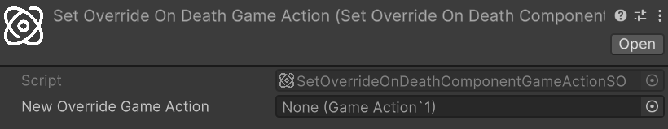
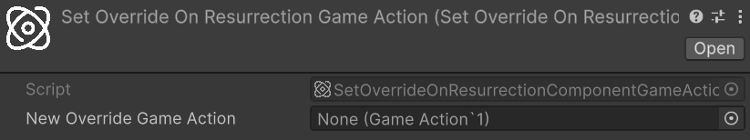
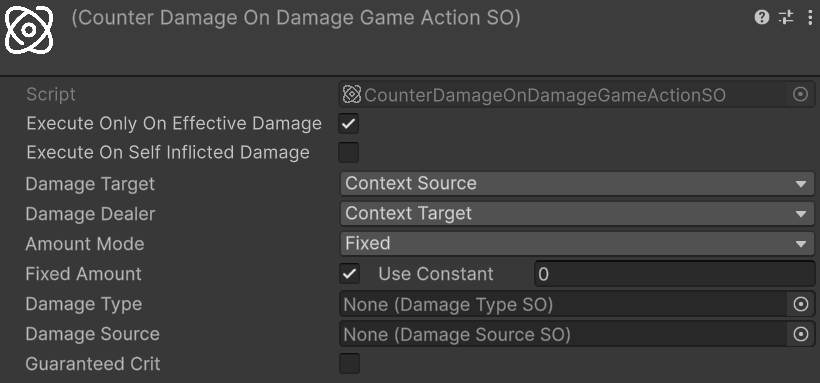

# Game Actions

Astra Health extends the framework's [`GameAction`](https://electricdrill.github.io/AstraRpgFrameworkDocs/MD/workflows.html#game-actions) system with a set of health-specific actions for resurrection, override management, and damage reactions. Each action is a `ScriptableObject` built on top of `GameAction<TContext>` and integrates directly with `EntityHealth` and the event system.

For an introduction to the `GameAction` execution model, execution with Unity Events, and the difference between `ExecuteAsync` and `RunFireAndForget`, refer to the [Game Actions](https://electricdrill.github.io/AstraRpgFrameworkDocs/MD/workflows.html#game-actions) section of the Astra Framework documentation.

## IHasEntity-Based Actions

The recommended way to use the health game actions is through the `IHasEntity`-based variants. Most event context payloads raised by the health package — `DamageResolutionContext`, `EntityDiedContext`, `PreDamageContext`, `ResurrectionContext`, and others — implement the framework's `IHasEntity` interface, which exposes the primary `EntityCore` subject of the event. This means that any `GameEventListener` whose payload implements `IHasEntity` can drive these actions directly without any adapter or component extraction.

The `IHasEntity`-based variants are listed under `Astra Health/Game Actions/Context: Entity/` in the asset creation menu and should be the first choice whenever actions are wired to a `GameEventListener` response.

## Resurrect

`ResurrectEntityGameActionSO<TContext>` is the abstract base action for resurrecting a dead entity. It resolves the `EntityHealth` component from `context.Entity` and calls the appropriate convenience `Resurrect` overload — either with a percentage of max HP or with a flat HP amount — depending on the inspector configuration.

The sealed `ResurrectEntityIHasEntityGameActionSO` is the ready-to-use instantiable variant with `IHasEntity` as the context type.  
*Relative path:* `Astra Health/Game Actions/Context: Entity/Resurrect`

Its inspector fields, configuration options, and a common automatic-respawn use case are documented in the [Resurrect Game Action](./resurrection.md#the-resurrect-game-action) section of the Resurrection workflow.

> [!NOTE]
> Because all health event payloads implement `IHasEntity`, `ResurrectEntityIHasEntityGameActionSO` can be connected directly to any `GameEventListener` in the package — for example to an `EntityDiedGameEventListener` to trigger an automatic resurrection on death — without extracting a `Component` reference first.

## Set Override On Death
*Relative path:* `Astra Health/Game Actions/Context: Entity/Set Override On Death`  

`SetEntityOverrideOnDeathGameActionSO<TContext>` assigns or clears the `OverrideOnDeathGameAction` property on an entity's `EntityHealth` component at runtime. It gives any system or workflow the ability to redirect what happens the next time a specific entity dies, without modifying the global configuration or the entity's inspector directly.

The configurable field is:

- **New Override Game Action**: the `GameAction<IHasEntity>` to assign as the entity's next on-death action. Leave this field empty to clear any previously set override, causing the entity to fall back to the **Default On Death Game Action** from the package configuration

**Use Cases**:
- One-shot death mechanics: place a `SetEntityOverrideOnDeathGameActionSO` inside a `CompositeGameAction` that first resurrects the entity and then clears the override (by leaving **New Override Game Action** empty). The first time the entity dies the override fires — resurrecting it — and removes itself so subsequent deaths use the default behavior
- Dynamic difficulty: assign a stronger or weaker on-death routine to a specific entity at runtime based on game state

> [!NOTE]
> The action resolves `EntityHealth` from the context via `context.Entity.GetComponent<EntityHealth>()`. If the entity does not have an `EntityHealth` component, a warning is logged and the action does nothing.

The sealed `SetEntityOverrideOnDeathIHasEntityGameActionSo` is the instantiable variant with `IHasEntity` as the context type:

## Set Override On Resurrection
*Relative path:* `Astra Health/Game Actions/Context: Entity/Set Override On Resurrection`  

`SetEntityOverrideOnResurrectionGameActionSO<TContext>` mirrors its death counterpart: it assigns or clears the `OverrideOnResurrectionGameAction` property on an entity's `EntityHealth` component, redirecting the post-resurrection behavior the next time that entity is resurrected.

The configurable field is:

- **New Override Game Action**: the `GameAction<IHasEntity>` to assign as the entity's next on-resurrection action. Leave this field empty to clear the override and fall back to the **Default On Resurrection Game Action** from the package configuration

The sealed `SetEntityOverrideOnResurrectionIHasEntityGameActionSo` is the instantiable variant with `IHasEntity` as the context type:

## Context Projection Actions

Context projection actions allow a broad `IHasEntity` listener to forward its payload to an action that expects a richer, more specific context type. The base class `EntityContextCastProjectionGameAction<TProjectedContext>` attempts a runtime cast from `IHasEntity` to `TProjectedContext` and, if the cast succeeds, delegates to the wrapped inner action; if the cast fails, the action silently does nothing.

Use these actions when a single `GameEventListener` needs to drive logic that lives inside an action typed on a concrete context — for example, routing an `EntityDiedGameEventListener` response through to a `CounterDamageOnDeathGameActionSO` without writing a custom listener.

Three sealed implementations are provided:

- **`EntityContextToDamageResolutionContextProjectionGameAction`** — narrows `IHasEntity` to `DamageResolutionContext` and forwards to a `GameAction<DamageResolutionContext>`. Created via `Astra Health/Game Actions/Context: Entity/Projections/→ DamageResolutionContext Projection`

- **`EntityContextToEntityDiedContextProjectionGameAction`** — narrows `IHasEntity` to `EntityDiedContext` and forwards to a `GameAction<EntityDiedContext>`. Created via `Astra Health/Game Actions/Context: Entity/Projections/→ EntityDiedContext Projection`

- **`EntityContextToPreDamageContextProjectionGameAction`** — narrows `IHasEntity` to `PreDamageContext` and forwards to a `GameAction<PreDamageContext>`. Created via `Astra Health/Game Actions/Context: Entity/Projections/→ PreDamageContext Projection`

The configurable field on each projection action is:

- **Inner Action**: the `GameAction<TProjectedContext>` to execute when the cast succeeds. Leave empty to produce a no-op.

## Counter Damage

`CounterDamageGameActionSO<TContext>` is the abstract base for actions that react to a damage or death event by immediately inflicting a new hit in return. The action reads role assignments and a damage configuration from the inspector, resolves the correct entities from the event context, and calls `EntityHealth.TakeDamage` on the resolved target.

`CounterDamageGameActionSO<TContext>` implements `IEffectInstigator`, so it registers itself as the instigator of the counter-damage it produces. Downstream listeners can compare `context.Instigator` against the action asset to identify and filter self-triggered events — the primary mechanism for preventing infinite damage cycles (see [Preventing Infinite Cycles](#preventing-infinite-cycles) below).

`TContext` must implement `IHasTarget`, `IHasPerformer`, `IHasInstigator`, and `IHasAmount`. The compatible built-in context types are `DamageResolutionContext`, `EntityDiedContext`, and `PreDamageContext`.

The top-level configurable fields are:

- **Execute Only On Effective Damage**: when enabled (the default), the counter-damage fires only if the incoming `Amount` is non-null and greater than zero. Disable to also react to prevented or zero-damage hits
- **Execute On Self Inflicted Damage**: when enabled, the counter-damage fires even when the instigator of the incoming event is this same action asset. Leave disabled (the default) to suppress the counter when this action already caused the incoming event, preventing infinite loops
- **Config**: the inline `PreDamageContextConfig` block that describes the counter-damage to apply (see [Counter Damage Configuration](#counter-damage-configuration) below)

### Counter Damage Configuration

The **Config** block is a serialized `PreDamageContextConfig` that fully defines the counter-damage: who takes it, who is attributed as the dealer, how the amount is computed, and what damage type and source are applied.

- **Damage Target**: which entity from the incoming context receives the counter-damage. `ContextSource` targets the entity that performed the original action (`context.Performer`); `ContextTarget` targets the entity that received it (`context.Target`)
- **Damage Dealer**: which entity from the incoming context is attributed as the dealer. `ContextSource` maps to the performer, `ContextTarget` maps to the original target, and `None` produces system-initiated damage with no attribution
- **Amount Mode**: determines how the counter-damage amount is computed:
  - `Fixed` — a constant value from a **Fixed Amount** `LongRef` asset
  - `ScalingFormula` — computed at runtime from a **Scaling Formula** asset (dealer maps to _Self_, target to _Target_). If the dealer is null (system damage), the formula falls back to `CalculateValue(target, target)` with a warning
  - `DamageFromContext` — a fraction of the incoming `Amount`, scaled by the **Damage From Context Multiplier** (e.g. `0.5` = 50% of the received damage)
- **Damage Type**: the `DamageTypeSO` applied to the counter-damage
- **Damage Source**: the `DamageSourceSO` attributed to the counter-damage
- **Guaranteed Crit**: when enabled, the counter-hit is always flagged as a critical
- **Use Crit Stat**: when **Guaranteed Crit** is active, reads the critical multiplier from the **Crit Multiplier Stat** on the dealer entity instead of from the inline **Critical Multiplier** value
- **Crit Multiplier Stat**: the stat on the dealer entity whose value is used as the critical multiplier (e.g. a stat value of `200` becomes `2.0×`). Active only when both **Guaranteed Crit** and **Use Crit Stat** are enabled
- **Critical Multiplier**: the inline critical multiplier as a percentage (e.g. `150` = `1.5×`). Active when **Guaranteed Crit** is enabled and **Use Crit Stat** is disabled

> [!WARNING]
> If **Damage Type** or **Damage Source** is left unassigned, the system logs a warning at runtime and the resulting `PreDamageContext` may behave unexpectedly.

Let's see a concrete example of a damage-reflection setup. Entity `A` attacks entity `B`, which has a `CounterDamageOnDamageGameActionSO` listening to its `DamageResolutionGameEventListener`. When the hit resolves:
- `context.Performer` = `A` (the attacker)
- `context.Target` = `B` (the defender)
- `context.Amount` = the damage actually dealt

To reflect damage back at `A` with a fixed amount attributed to `B`, configure:
- **Damage Target** = `ContextSource` (the counter-damage targets the performer, `A`)
- **Damage Dealer** = `ContextTarget` (the counter-damage is dealt by the original target, `B`)
- **Amount Mode** = `Fixed`, with **Fixed Amount** set to the desired flat value

This example assumes no other damage modifications are active.

### Real-World Examples

Two passive ability implementations from the sample scene illustrate `CounterDamageGameActionSO` in concrete setups.

**Vengeance in Death (Assassin passive)** uses `CounterDamageOnDeathGameActionSO` to strike back at the attacker with a guaranteed critical physical hit equal to 80% of the lethal damage received. **Damage Target** is `ContextSource` (the attacker), **Damage Dealer** is `ContextTarget` (the Assassin), **Amount Mode** is `DamageFromContext` with a multiplier of `0.8`, and **Guaranteed Crit** is enabled with **Use Crit Stat** pointing to the Assassin's critical multiplier stat. To avoid firing on every entity's death, the action is wired to a dedicated `EntityDiedGameEvent` assigned as an extra death event on the Assassin's death Event Channel rather than to the global death event. See [Vengeance in Death](../samples.md#passive-ability-assassin---vengence-in-death) in the Samples page for the full setup.

**Glass Cannon (Sorcerer passive)** uses `CounterDamageOnDamageGameActionSO` to deal bonus magical self-damage equal to 15% of the Sorcerer's Magic Power every time the Sorcerer is hit. **Damage Target** is `ContextTarget` (the Sorcerer itself), **Damage Dealer** is `None`, **Amount Mode** is `ScalingFormula` with a formula that evaluates 15% of Magic Power. To avoid reacting to other entities' damage events, the action is wired to a dedicated `DamageResolutionGameEvent` assigned as an extra damage-taken event on the Sorcerer's damage Event Channel. **Execute On Self Inflicted Damage** remains disabled so the self-damage this action produces does not re-trigger the action. See [Glass Cannon](../samples.md#passive-ability-sorcerer---glass-cannon) in the Samples page for the full setup.

### Preventing Infinite Cycles

Counter-damage actions can produce infinite loops: `A` damages `B`, `B` counters `A`, `A`'s counter reacts to `B`'s hit, and so on. Three complementary mechanisms help contain runaway chains:

- **Disable Execute On Self Inflicted Damage** (default): because `CounterDamageGameActionSO` implements `IEffectInstigator` and passes itself as the instigator of the counter-damage it produces, any subsequent event caused by that counter carries the action asset as `context.Instigator`. When **Execute On Self Inflicted Damage** is disabled, the action skips execution whenever the incoming instigator matches itself — suppressing a single action from reacting to its own direct output
- **Enable Execute Only On Effective Damage** (default): zero-damage or prevented hits do not trigger a counter, reducing the chance of a chain reaction starting from a suppressed hit
- **Reactability marker**: every damage and heal context carries an `IsReactable` flag. When `CounterDamageGameActionSO` receives a context with `IsReactable == false`, it skips execution immediately. Every `PreDamageContext` built by the action always has `IsReactable` set to `false`, and this propagates automatically to the resulting `DamageResolutionContext` and, if the hit is lethal, to the `EntityDiedContext`

The third mechanism is what breaks the mutual counter-chain that the first two cannot. If entity `A` owns counter action `CDA` and entity `B` owns counter action `CDB`: `A` hits `B` with a first-order `IsReactable = true` event → `CDB` fires, hits `A` with `IsReactable = false` → `CDA` receives a non-reactable context and skips — the chain ends after one counter.

The `IsReactable` flag is also available on `PreHealContext` and `ReceivedHealContext`, following the same convention. Use `.WithIsReactable(false)` on the builder when constructing any secondary heal (for example, a passive ability that heals on receiving damage) to prevent heal-triggered chains.

> [!NOTE]
> Code that constructs `PreDamageContext` instances directly — for example, a custom passive ability that deals secondary damage in response to an event — should call `.WithIsReactable(false)` on the builder when the resulting hit is a secondary effect and should not trigger further reactive systems.

> [!WARNING]
> Enabling **Execute On Self Inflicted Damage** removes the self-instigator guard. Only do so when the action is intentionally designed to react to its own outputs, and ensure an alternative termination condition is in place.

### Available Variants

Three sealed implementations are provided, each bound to a specific context type:

- **`CounterDamageOnDamageGameActionSO`** — context: `DamageResolutionContext`. Reacts to a resolved damage event. Connect to a `DamageResolutionGameEventListener`'s UnityEvent response and select `ExecuteAsyncForUnityEvent(DamageResolutionContext)` as the dynamic invocation target. Created via `Astra Health/Game Actions/Context: DamageResolutionContext/Counter Damage`

- **`CounterDamageOnDeathGameActionSO`** — context: `EntityDiedContext`. Reacts when an entity dies. Connect to an `EntityDiedGameEventListener`'s UnityEvent response and select `ExecuteAsyncForUnityEvent(EntityDiedContext)` as the dynamic invocation target. Created via `Astra Health/Game Actions/Context: EntityDiedContext/Counter Damage`

- **`CounterDamageOnPreDamageGameActionSO`** — context: `PreDamageContext`. Reacts before the damage calculation pipeline runs. Connect to a `PreDamageGameEventListener`'s UnityEvent response and select `ExecuteAsyncForUnityEvent(PreDamageContext)` as the dynamic invocation target. Created via `Astra Health/Game Actions/Context: PreDamageContext/Counter Damage`

> [!NOTE]
> When using `CounterDamageOnPreDamageGameActionSO`, `context.Amount` is the pre-modifier base damage amount rather than the final resolved damage. The **Execute Only On Effective Damage** check therefore evaluates the base amount, not the post-calculation result.

## Composite Pre-Damage Context
*Relative path:* `Astra Health/Game Actions/Context: PreDamageContext/Composite`  

`CompositePreDamageContextGameActionSO` is a sealed implementation of the framework's `CompositeGameAction<PreDamageContext>`. It executes a list of `GameAction<PreDamageContext>` actions in sequence, passing the same `PreDamageContext` to each. Use it to chain multiple pre-damage context actions — for example, a `CounterDamageOnPreDamageGameActionSO` followed by a state modifier — within a single `PreDamageGameEventListener` response.
